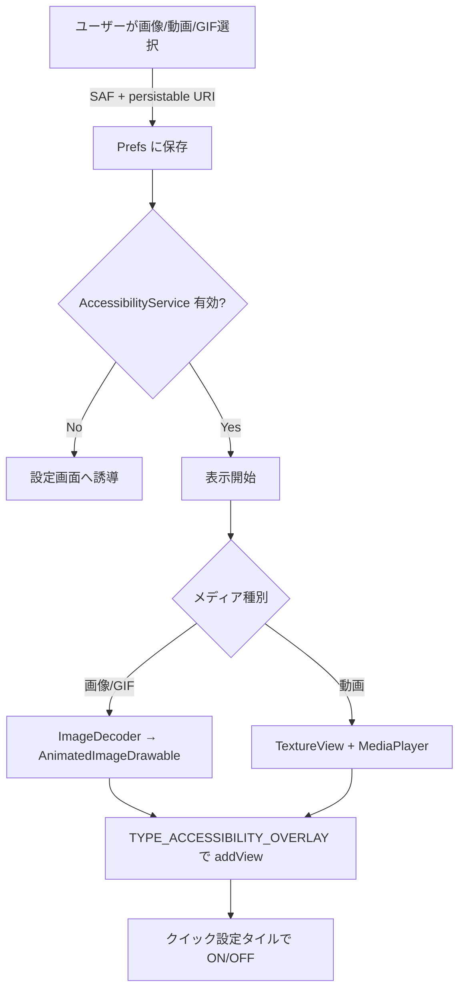

<div align="center">

# OverlayPin

### 画像 / 動画 / GIF を画面に常時表示するAndroidアプリ

[](https://kotlinlang.org/)
[](https://developer.android.com/)
[](https://gradle.org/)
[](LICENSE)

**好きな画像・GIF・動画を他アプリの上に重ねて、画面中央に常時貼り付けられる**

---

</div>

## 概要

Androidで画面に画像/動画/GIFを「ピン留め」するように表示するアプリ。ゲーム中・動画視聴中・他アプリ使用中でも**常に最前面**に残り続ける。位置・サイズ・半透明度はプレビュー画面でライブ調整可能。クイック設定タイルでワンタップON/OFF。

一部の中国系ROM（MIUI / HyperOS 等）が `TYPE_APPLICATION_OVERLAY` に適用する装飾で半透明に見える問題を回避するため、**AccessibilityService 経由の `TYPE_ACCESSIBILITY_OVERLAY`** を使う構成にしている。

## 特徴

| 機能 | 内容 |
|---|---|
| 対応メディア | 静止画 (JPG/PNG/WebP)、**GIF** (自動ループ)、動画 (MP4/WebM等、ミュート+ループ再生) |
| 常時最前面 | 他アプリ・ゲーム中もオーバーレイが見え続ける |
| タッチ透過 | オーバーレイは一切タッチを奪わない。下のアプリ/ゲームは普通に操作可 |
| 位置設定 | 実画面の縦横比と一致したプレビュー内でドラッグ/タップ |
| サイズ | 10%〜200%（5%刻み、+/-ボタン付き） |
| 半透明モード | ON: α=0.5 / OFF: α=1.0 |
| クイック設定タイル | 右上スワイプのクイック設定から「オーバーレイ」タイル追加でワンタップ切替 |
| 回転対応 | 端末回転時に画像の向きを固定（表示が変わらない） |
| 設定永続化 | 画像URI、位置、サイズ、半透明、メディア種別を保存 |

## 処理フロー



## 技術ポイント

- **AccessibilityService** + `TYPE_ACCESSIBILITY_OVERLAY` でROM依存の overlay 装飾を回避
- **ImageDecoder** / **AnimatedImageDrawable** (API 28+) で静止画・GIF を単一コードパス
- **TextureView** + **MediaPlayer** で動画をアスペクト比維持したまま描画 (FIT_CENTER 相当の Matrix 変換)
- 位置は画面サイズ非依存の分数 (0.0〜1.0) で保存、回転・解像度変更に強い
- Quick Settings `TileService` からサービス toggle
- `FLAG_HARDWARE_ACCELERATED` + `View.LAYER_TYPE_HARDWARE` で透過描画の安定化

## インストール

### APK から

Releases ページから最新の `app-debug.apk` をダウンロードしてインストール。提供元不明のアプリを許可する必要がある。

### ソースからビルド

```bash
git clone https://github.com/cUDGk/overlay-pin.git
cd overlay-pin
./gradlew assembleDebug
adb install -r app/build/outputs/apk/debug/app-debug.apk
```

Android SDK 35 + JDK 17+ が必要。`local.properties` に `sdk.dir=...` を書く。

## 使い方

1. アプリ起動
2. **「画像を選択」** で画像/GIF/動画を選ぶ
3. **「Accessibility を有効化」** → 後述の手順でONにする
4. **「オーバーレイ権限を許可」** で権限付与（通常の権限画面、ONにするだけ）
5. プレビュー内をドラッグ（または X/Y スライダ）で位置決定
6. サイズ・不透明度を調整
7. **「表示開始」** で常時最前面に表示

### Accessibility Service を有効化

本アプリは **`TYPE_ACCESSIBILITY_OVERLAY`** で表示を行う。一部のROM（特に MIUI / HyperOS）が `TYPE_APPLICATION_OVERLAY` に半透明装飾を被せる挙動を回避するため。Accessibility 権限の許可が必須。

#### 通常手順（素のAndroid・ほとんどのROM）

1. アプリ画面の **「Accessibility を有効化」** ボタンをタップ
2. 開いた設定画面で **「ダウンロードしたアプリ」** または **「インストールされたサービス」** を選ぶ
3. **OverlayPin** を選ぶ
4. トグルを **ON** → 確認ダイアログで「許可」

#### MIUI / HyperOS で「制限された設定」ブロックが出る場合

サイドロードしたアプリの Accessibility は Android 13+ / MIUI でデフォルトブロックされる。以下のどちらかで解除:

**方法A: 端末だけで解除**

1. 設定 → アプリ → アプリを管理 → **OverlayPin** を選ぶ
2. 画面右上の「⋮」（三点メニュー）をタップ
3. **「制限された設定を許可」** (英語: `Allow restricted settings`) を選ぶ → 確認
4. 通常手順の 2〜4 に戻って有効化

メニュー名は MIUI バージョンで表記ゆれあり:
- 「制限された設定を許可」
- 「制限付き設定を許可」
- 「制限されている設定を有効化」

**方法B: ADB で一発解除**

```bash
adb shell appops set com.overlaypin.app ACCESS_RESTRICTED_SETTINGS allow
```

これで `ACCESS_RESTRICTED_SETTINGS: allow` に設定され、以降は通常手順の 2〜4 で有効化できる。

#### 確認

アプリ画面のステータス行に `Accessibility: ✓` と出ていれば完了。

### クイック設定タイル

1. 右上スワイプでクイック設定を開く
2. 編集（鉛筆マーク）を開く
3. 「オーバーレイ」タイルをドラッグして上部に追加
4. 以降はクイック設定からワンタップで ON/OFF

## ライセンス

[MIT License](LICENSE) — Copyright (c) 2026 cUDGk
